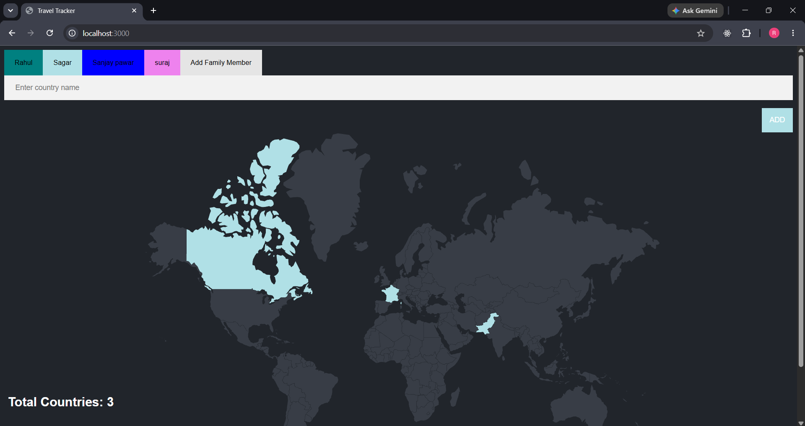
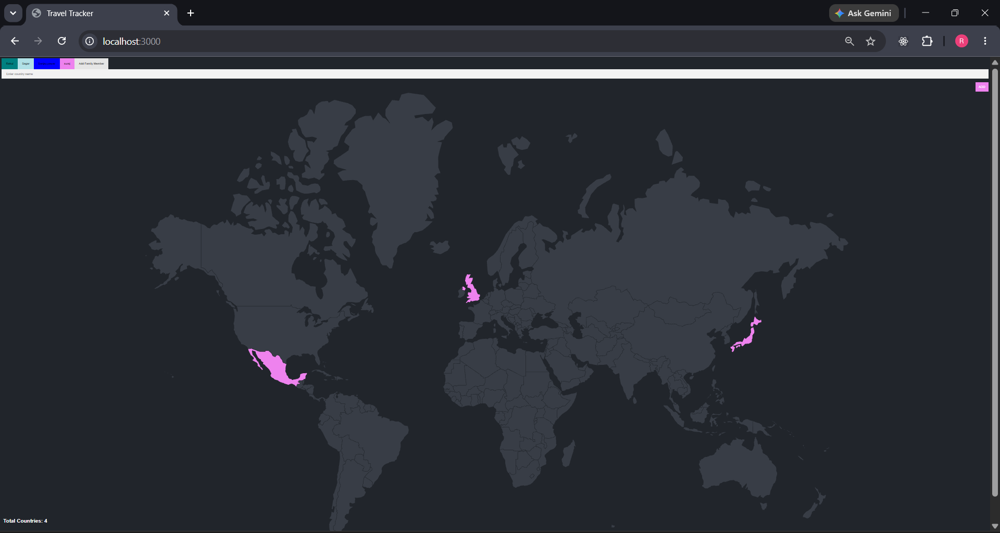
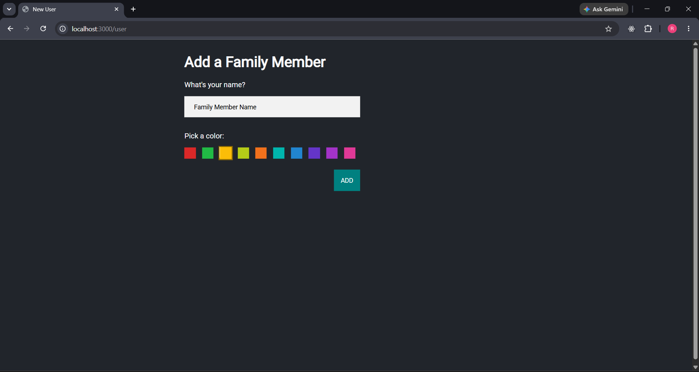

# 🌍 Family Travel Tracker

A multi-user travel tracker web app where each family member can track the countries they have personally visited on an interactive world map. Switch between profiles, add new members, and see each person's travels highlighted in their own unique color.

---

## ✨ Features & How Each Part Works

### 👨‍👩‍👧‍👦 Multiple Family Member Profiles
Each family member has their own profile stored in the database with a unique name and color. All profiles appear as clickable tabs at the top of the page. Clicking a tab switches to that person's map view — their visited countries light up in their personal color.

The tab form works like this:
```html
<input type="submit" name="user" value="<%= user.id %>" id="<%= user.id %>">
<label style="background-color: <%= user.color %>"><%= user.name %></label>
```
Submitting sends a POST to `/user` with the selected user's `id`, switching the active profile.

---

### ➕ Add a New Family Member
Clicking **"Add Family Member"** sends `name="add" value="new"` to `/user`. The server detects this and renders `new.ejs` — a form where you enter a name and pick a color. On submit, a new row is inserted into the `users` table and that person immediately becomes the active user.

```
POST /user (add=new)
    ↓
Renders new.ejs (name + color form)
    ↓
POST /new
    ↓
INSERT INTO users (name, color) VALUES ($1, $2)
    ↓
New user becomes active → redirect to "/"
```

---

### 🗺️ Per-User Country Map
Every visited country is stored with a `user_id` so each person's data is completely separate. The `checkVisisted()` function fetches only the current user's countries:

```js
SELECT visited_countries.country_code
FROM visited_countries
WHERE user_id = $1    // only current user's countries
```

The map then highlights those countries using each user's personal color:
```js
countryElement.style.fill = "<%= color %>";
```
So Rahul's map might show countries in `teal`, while Sagar's shows in `powderblue`.

---

### ➕ Add a Visited Country
Typing a country name and hitting Add triggers a POST to `/add`. The server:

1. Searches the `countries` table using partial, case-insensitive matching
2. Gets the ISO country code (e.g., "india" → "IN")
3. Inserts it into `visited_countries` linked to the current user's `user_id`

```
User types "france"
    ↓
SELECT country_code FROM countries WHERE LOWER(country_name) LIKE '%france%'
    ↓
Gets "FR"
    ↓
INSERT INTO visited_countries (country_code, user_id) VALUES ('FR', 2)
    ↓
Redirect "/" → map re-renders with FR highlighted
```

---

### 🔢 Per-User Country Counter
The total count shown at the bottom left only counts countries for the currently active user — not all countries across all family members.

```js
countries.length  // only current user's visited countries
```

---

### 🎨 Per-User Color Theme
Each user's color dynamically styles both the map highlights AND the Add button:
```html
<button type="submit" style="background-color: <%= color %>;">Add</button>
```
So the entire UI feels personalized to whoever is currently active.

---

### 🔒 Country Code Safety
To prevent rendering bugs, country codes are cleaned before being used to find SVG paths:
```js
const cleanCode = code.trim().toUpperCase();
const countryElement = document.getElementById(cleanCode);
```
This ensures codes like `" in"` or `"fr "` still match the correct SVG path IDs.

---

## 🛠️ Tech Stack

| Layer | Technology |
|-------|-----------|
| Backend | Node.js, Express.js |
| Database | PostgreSQL |
| Frontend | EJS Templating, Vanilla JavaScript |
| Styling | Custom CSS (Responsive) |
| Map | Inline SVG (ISO 2-letter path IDs) |
| Config | dotenv (.env file) |
| Form Parsing | body-parser |

---

## 🗄️ Database Schema

```sql
-- All world countries with ISO codes
CREATE TABLE countries (
  id SERIAL PRIMARY KEY,
  country_code VARCHAR(10) NOT NULL,
  country_name VARCHAR(100) NOT NULL
);

-- Family member profiles
CREATE TABLE users (
  id SERIAL PRIMARY KEY,
  name VARCHAR(100) NOT NULL,
  color VARCHAR(50) NOT NULL
);

-- Visited countries linked to each user
CREATE TABLE visited_countries (
  id SERIAL PRIMARY KEY,
  country_code VARCHAR(10) NOT NULL,
  user_id INTEGER REFERENCES users(id)
);
```

---

## 📁 Project Structure

```
Family-Travel-Tracker/
├── index.js              # Express server — all routes and DB logic
├── views/
│   ├── index.ejs         # Main page — tabs, SVG map, add form
│   └── new.ejs           # Add new family member form
├── styles/
│   └── main.css          # Dark theme + responsive layout
├── public/               # Static assets
├── .env                  # DB credentials (not committed to Git)
└── package.json
```

---

## ⚙️ How It Works — Full Request Flow

```
Browser                     Express Server               PostgreSQL
  |                               |                           |
  |-- GET /  ──────────────────> |                           |
  |                               |-- SELECT country_code     |
  |                               |   WHERE user_id = 1      |
  |                               |<-- [IN, FR, JP]          |
  |                               |-- SELECT * FROM users    |
  |                               |<-- [Rahul, Sagar]        |
  |<-- index.ejs (map + tabs) ---|                           |
  |                               |                           |
  |-- POST /user (user=2) ──────>|                           |
  |                               |   currentUserId = 2      |
  |<-- redirect to / ────────── |                           |
  |                               |                           |
  |-- POST /add (country=japan)─>|                           |
  |                               |-- SELECT country_code    |
  |                               |   WHERE name LIKE japan  |
  |                               |<-- JP                    |
  |                               |-- INSERT INTO            |
  |                               |   visited_countries      |
  |                               |   (JP, user_id=2)        |
  |<-- redirect to / ───────────|                           |
```

---

## 🔧 Setup & Run Locally

**1. Clone the repository**
```bash
git clone https://github.com/rahulpawar-o7/Family-Travel-Tracker.git
cd Family-Travel-Tracker
```

**2. Install dependencies**
```bash
npm install
```

**3. Create a `.env` file in the root directory**
```
DB_USER=your_postgres_user
DB_HOST=localhost
DB_NAME=your_database_name
DB_PASSWORD=your_postgres_password
DB_PORT=5432
```

**4. Set up the PostgreSQL database**
```sql
CREATE TABLE countries (
  id SERIAL PRIMARY KEY,
  country_code VARCHAR(10) NOT NULL,
  country_name VARCHAR(100) NOT NULL
);

CREATE TABLE users (
  id SERIAL PRIMARY KEY,
  name VARCHAR(100) NOT NULL,
  color VARCHAR(50) NOT NULL
);

CREATE TABLE visited_countries (
  id SERIAL PRIMARY KEY,
  country_code VARCHAR(10) NOT NULL,
  user_id INTEGER REFERENCES users(id)
);

-- Import world countries data
-- COPY countries FROM '/path/to/countries.csv' DELIMITER ',' CSV HEADER;

-- Add initial family members
INSERT INTO users (name, color) VALUES ('Rahul', 'teal');
INSERT INTO users (name, color) VALUES ('Sagar', 'powderblue');
```

**5. Run the server**
```bash
node index.js
```

Open `http://localhost:3000`

---

## 📸 Screenshots






---

## 💼 Key Logic Highlights

- **`currentUserId`** — Server-side variable that tracks the active family member across requests
- **`checkVisisted()`** — Async function that queries DB filtered by `user_id`, returns trimmed uppercase codes
- **`getCurrentUser()`** — Refreshes user list from DB and returns the active user object
- **Per-user color theming** — EJS injects `color` into both the SVG fill and the Add button style
- **`POST /user` dual behavior** — Same route handles both profile switching and redirecting to the new member form
- **`POST /new`** — Creates user, gets the returned row (`RETURNING *`), sets it as current user

---

## 👤 Author

**Rahul Pawar**
- GitHub: [@rahulpawar-o7](https://github.com/rahulpawar-o7)
- LinkedIn: [Rahul Pawar](https://www.linkedin.com/in/rahul-pawar-a09404358)
